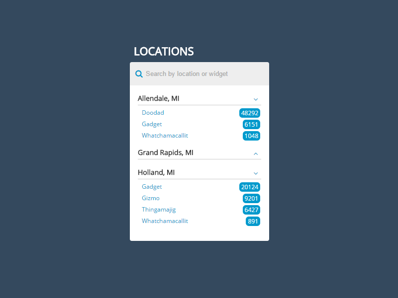

## SalesPad Front-End Job Application

### Requirements
Create a web app which loads `./app/data.json` and displays a list of locations and widget counts (see mock-up).
* The app should run by executing the command `python -m http.server 8000` from the `./app` directory.
* Use [fontawesome.io](http://fontawesome.io) for the icons.
* The search input should filter by both location and widget name
* Email your app in a .zip with your resume to [jobs@salespad.net](mailto:jobs@salespad.net) with the subject ‘Front End Developer Application’;

### Bonus Points
* Use a CSS preprocessor (SASS / LESS)
* Use browser-sync with Gulp or Grunt instead of http.server
* Use lodash.js and include a comment on your favorite lodash function

